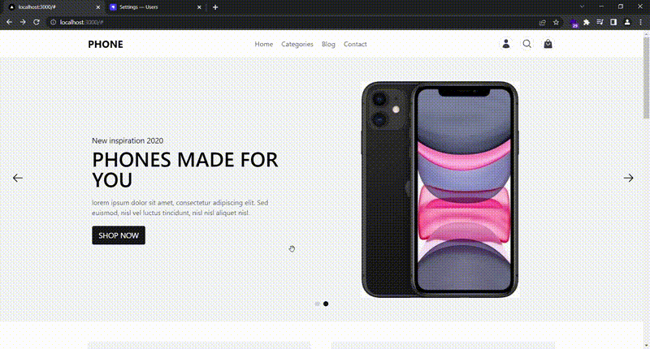
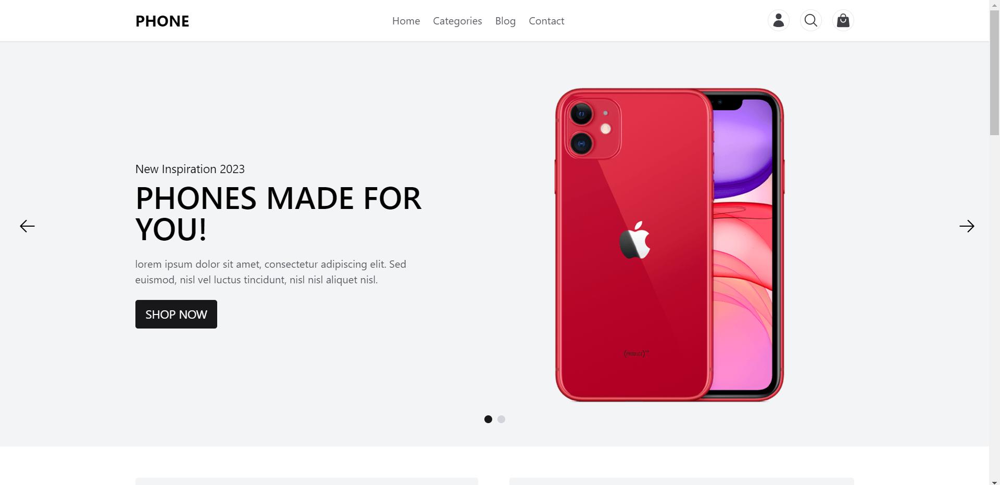
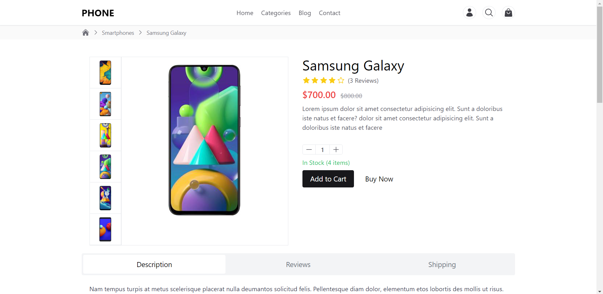
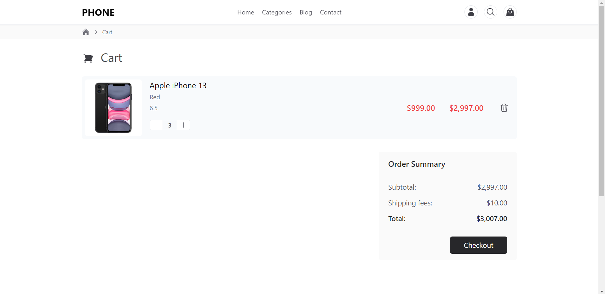

# NextJS E-commerce App




## Technologies used
- NextJS
- Typescript
- TailwindCSS
- Zustand
- Headless UI
- Strapi

## Getting Started
### Clone the repo
```sh
 git clone https://github.com/abdellah711/next-ecommerce-app.git
```

## Install dependencies
```sh
yarn
```

## Run Strapi server
```sh
yarn server
```

## Run NextJS server 
```sh
yarn dev
```

